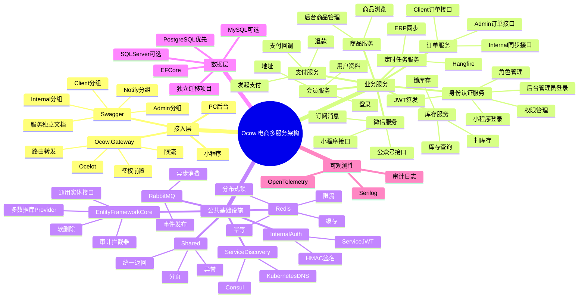

# Ocow 电商多服务架构设计

## 1. 核心结论

Ocow 采用「多人多服务开发」架构，不再使用集中式 `Ocow.Api` / `Ocow.Admin.Api` 承载所有业务 Controller。每个业务服务独立拥有自己的 `Api / Application / Domain / Infrastructure / Migrations`，小程序端 Controller、PC 后台 Controller、内部服务 Controller 都放在对应业务服务内，通过目录和路由区分。

默认技术选型：

- 后端框架：.NET 8 / ASP.NET Core Web API
- API 网关：Ocelot
- 同步内部调用：HTTP REST，后续高频强契约接口可评估 gRPC
- 异步解耦：RabbitMQ
- 缓存与分布式能力：Redis
- 定时任务：Hangfire
- ORM：EF Core
- 数据库：PostgreSQL 优先，同时预留 MySQL、SQL Server 兼容能力
- 日志：Serilog
- 链路追踪：OpenTelemetry

核心原则：

- 小程序端、PC 后台端、内部服务端三类接口必须隔离。
- 业务服务之间不直接引用对方具体实现。
- 需要立即返回结果的内部调用优先使用 HTTP REST。
- 可以最终一致的业务通知优先使用 RabbitMQ。
- Redis 只做缓存、限流、分布式锁、幂等和短期状态，不作为主数据库。
- 登录认证和权限中心独立为 `Ocow.Identity` 服务。
- 微信普通开放接口独立为 `Ocow.WeChat` 服务，微信支付仍放 `Ocow.Payment`。

## 2. 项目清单

| 项目名 | 说明 |
|---|---|
| `Ocow.Gateway` | Ocelot 网关，统一接入小程序和 PC 后台请求 |
| `Ocow.Order.Api` | 订单服务 HTTP 入口，包含小程序订单、后台订单、内部订单接口 |
| `Ocow.Order.Application` | 订单应用层，负责编排下单、取消、发货、同步等用例 |
| `Ocow.Order.Domain` | 订单领域层，包含订单实体、订单状态、领域规则 |
| `Ocow.Order.Infrastructure` | 订单基础设施层，包含 EF Core、仓储、Redis、外部服务适配 |
| `Ocow.Order.Migrations` | 订单服务 EF Core 迁移项目 |
| `Ocow.Product.*` | 商品服务，负责商品、SKU、类目、品牌、上下架 |
| `Ocow.Payment.*` | 支付服务，负责支付单、退款、支付回调、微信支付等资金链路 |
| `Ocow.Identity.*` | 身份认证服务，负责小程序登录、后台管理员登录、角色、权限、Token 签发 |
| `Ocow.Member.*` | 会员服务，负责登录、用户资料、地址、会员关系 |
| `Ocow.Inventory.*` | 库存服务，负责库存查询、锁库存、扣库存、释放库存 |
| `Ocow.WeChat.*` | 微信集成服务，负责小程序、公众号、订阅消息、模板消息等普通微信接口 |
| `Ocow.Scheduler.*` | 定时任务服务，负责 Hangfire 任务配置、执行、日志 |
| `Ocow.Redis` | Redis 公共封装，提供缓存、分布式锁、限流、幂等能力 |
| `Ocow.MessageBus` | RabbitMQ 公共封装，提供发布订阅、重试、序列化 |
| `Ocow.InternalAuth` | 内部服务认证，提供 Service JWT、HMAC 签名、内部接口鉴权 |
| `Ocow.EntityFrameworkCore` | EF Core 通用封装，提供基础实体接口、审计拦截器、软删除、多数据库 Provider 扩展 |
| `Ocow.ServiceDiscovery` | 服务注册发现封装，适配 Consul、Nacos 或 Kubernetes DNS |
| `Ocow.Contracts` | 跨服务契约，放集成事件、公共消息模型 |
| `Ocow.Shared` | 公共基础能力，统一返回、分页、异常、工具类 |
| `Ocow.Tests.Unit` | 单元测试 |
| `Ocow.Tests.Integration` | 集成测试 |

## 3. Controller 设计

每个业务服务自己管理自己的 Controller，不让不同业务团队共同修改统一的 `Ocow.Api` 或 `Ocow.Admin.Api`。

订单服务示例：

```text
Ocow.Order.Api
  Controllers
    Client
      OrdersController.cs
    Admin
      AdminOrdersController.cs
    Internal
      InternalOrderSyncController.cs
```

路由约定：

```text
/api/orders/**             小程序/用户端订单接口
/api/admin/orders/**       PC后台订单接口
/internal/orders/**        内部服务接口
```

接口示例：

```text
POST /api/orders                  创建订单
GET  /api/orders                  我的订单列表
GET  /api/orders/{id}             我的订单详情
POST /api/orders/{id}/cancel      用户取消订单

GET  /api/admin/orders            后台订单列表
GET  /api/admin/orders/{id}       后台订单详情
PUT  /api/admin/orders/{id}/ship  后台发货

POST /internal/orders/sync/erp    ERP订单同步内部接口
```

Controller 只处理 HTTP 入参、鉴权上下文和返回结果，不写核心业务逻辑。核心业务放在 Application 和 Domain。

## 4. Swagger / OpenAPI 设计

所有 REST API 服务都必须接入 Swagger / OpenAPI，作为前后端联调、测试验证和接口文档的统一入口。

必须接入的服务：

```text
Ocow.Order.Api
Ocow.Product.Api
Ocow.Payment.Api
Ocow.Identity.Api
Ocow.Member.Api
Ocow.Inventory.Api
Ocow.WeChat.Api
Ocow.Scheduler
Ocow.Cart.Api
Ocow.Pricing.Api
Ocow.Promotion.Api
Ocow.Notification.Api
```

Swagger 分组：

| 分组 | 说明 | 路由示例 |
|---|---|---|
| `Client` | 小程序/用户端接口 | `/api/orders/**` |
| `Admin` | PC 后台接口 | `/api/admin/orders/**` |
| `Internal` | 内部服务接口 | `/internal/orders/**` |
| `Notify` | 第三方回调接口 | `/api/payments/wechat/notify` |

环境策略：

- 开发环境默认开启 Swagger。
- 测试环境可以开启 Swagger，但需要鉴权或内网访问。
- 生产环境默认关闭 Swagger，或仅允许内网/VPN 访问。
- 内部接口 `Internal` 分组不对公网暴露。

网关聚合策略：

- MVP 阶段：各服务自己暴露 Swagger，`Ocow.Gateway` 不做聚合。
- 第二阶段：`Ocow.Gateway` 可聚合各服务 Swagger，统一给前端和测试查看。

注释要求：

- Controller 必须有中文注释说明用途。
- Action 必须有中文注释说明接口作用。
- `ReqDto`、`ResDto` 必须有中文注释说明字段含义。
- Swagger 文档要能清楚区分小程序端、后台端、内部服务和第三方回调接口。

订单服务示例：

```text
Ocow.Order.Api Swagger Groups
  Client: /api/orders/**
  Admin: /api/admin/orders/**
  Internal: /internal/orders/**
```

## 5. Ocelot 网关设计

`Ocow.Gateway` 使用 Ocelot 作为统一入口。

调用关系：

```text
小程序 -> Ocow.Gateway -> Ocow.Order.Api / Ocow.Product.Api / Ocow.Payment.Api
PC后台 -> Ocow.Gateway -> Ocow.Order.Api / Ocow.Product.Api / Ocow.Payment.Api
```

本地 MVP 阶段使用 Ocelot 静态路由：

```text
/api/orders/**          -> Ocow.Order.Api
/api/admin/orders/**    -> Ocow.Order.Api
/api/products/**        -> Ocow.Product.Api
/api/admin/products/**  -> Ocow.Product.Api
/api/payments/**        -> Ocow.Payment.Api
/api/admin/payments/**  -> Ocow.Payment.Api
```

服务注册发现分阶段处理：

- 本地 MVP：Ocelot 静态路由。
- 测试环境：Ocelot + Consul。
- Kubernetes 环境：Ocelot + Kubernetes Service DNS。

第一阶段只配置静态路由，不立即接 Consul，降低骨架落地复杂度。

## 6. 身份认证与权限中心

新增 `Ocow.Identity` 作为统一身份认证与权限中心。它负责登录、认证、授权、Token 签发、管理员账号、角色和权限点，不负责订单、商品、支付等业务逻辑。

项目结构：

```text
Ocow.Identity.Api
Ocow.Identity.Application
Ocow.Identity.Domain
Ocow.Identity.Infrastructure
Ocow.Identity.Migrations
```

职责边界：

| 服务 | 职责 |
|---|---|
| `Ocow.Identity` | 管理员账号、管理员登录、角色、权限点、小程序登录、Token 签发、Token 刷新、登录日志 |
| `Ocow.Member` | 会员资料、收货地址、用户等级、积分、成长值 |
| `Ocow.WeChat` | code2Session、获取手机号、openid/unionid 解析、access_token 缓存、订阅消息 |

后台管理员接口：

```text
Ocow.Identity.Api
  Controllers
    Admin
      AdminAuthController.cs
      AdminUsersController.cs
      AdminRolesController.cs
      AdminPermissionsController.cs
```

后台路由：

```text
POST /api/admin/auth/login
POST /api/admin/auth/refresh-token
POST /api/admin/auth/logout

GET  /api/admin/users
POST /api/admin/users
PUT  /api/admin/users/{id}
POST /api/admin/users/{id}/disable

GET  /api/admin/roles
POST /api/admin/roles
PUT  /api/admin/roles/{id}

GET  /api/admin/permissions
PUT  /api/admin/roles/{id}/permissions
```

后台权限模型使用 RBAC：

```text
管理员 -> 角色 -> 权限点
```

权限点示例：

```text
order.read
order.ship
order.close
product.create
product.update
product.publish
payment.refund
scheduler.trigger
```

小程序登录接口：

```text
Ocow.Identity.Api
  Controllers
    Client
      ClientAuthController.cs
      ClientProfileController.cs
```

小程序路由：

```text
POST /api/auth/wechat-login
POST /api/auth/refresh-token
POST /api/auth/logout
GET  /api/auth/me
```

小程序登录链路：

```text
微信小程序
  -> Ocow.Gateway
  -> Ocow.Identity.Api
  -> Ocow.WeChat.Api code2Session
  -> 创建或绑定会员
  -> 签发 Customer JWT
```

后台登录链路：

```text
PC后台
  -> Ocow.Gateway
  -> Ocow.Identity.Api
  -> 校验管理员账号密码
  -> 加载角色和权限点
  -> 签发 Admin JWT
```

Token 区分：

| Token 类型 | 使用场景 | 典型内容 |
|---|---|---|
| `Customer JWT` | 小程序用户接口 | `memberId`、`openid`、`scope=client` |
| `Admin JWT` | PC 后台接口 | `adminUserId`、`roles`、`permissions`、`scope=admin` |
| `Service JWT` | 内部服务接口 | `serviceName`、`permissions`、`scope=internal` |

## 7. 认证与内部服务调用

三类调用使用三类身份：

| 调用来源 | Token 类型 | 说明 |
|---|---|---|
| 小程序端 | `Customer JWT` | 证明当前请求来自某个会员用户 |
| PC 后台端 | `Admin JWT` | 证明当前请求来自某个后台管理员 |
| 内部服务 | `Service JWT` | 证明当前请求来自系统内部服务 |

接口保护规则：

```text
/api/auth/**      小程序登录认证入口，允许匿名访问登录接口
/api/**          校验 Customer JWT
/api/admin/auth/** 后台登录认证入口，允许匿名访问登录接口
/api/admin/**    校验 Admin JWT 和权限点
/internal/**     校验 Service JWT，不允许用户 Token 调用
```

内部服务间调用就是自己的微服务调用自己的微服务，例如：

```text
Ocow.Scheduler -> Ocow.Order.Api
Ocow.Order.Api -> Ocow.Inventory.Api
Ocow.Payment.Api -> Ocow.Order.Api
```

内部服务调用默认使用 HTTP REST。高风险内部接口可增加 HMAC 签名：

```text
Authorization: Bearer {service_jwt}
X-Service-Name: Ocow.Scheduler
X-Timestamp: 2026-04-30T00:00:00Z
X-Nonce: 随机值
X-Signature: HMAC签名
X-Request-Id: 链路ID
```

`Ocow.InternalAuth` 负责：

- 生成 Service JWT
- 校验 Service JWT
- 校验内部接口权限
- 生成和校验 HMAC 签名
- 使用 Redis 防止 Nonce 重放

## 8. EF Core 与数据库访问设计

EF Core 的通用能力抽到 `Ocow.EntityFrameworkCore`，但各业务服务仍然保留自己的实体、DbContext、仓储实现和迁移项目。

放置原则：

```text
业务实体：放各服务 Domain/Models
EF Core 运行时实现：放各服务 Infrastructure
EF Core 迁移：放各服务 Migrations
具体业务种子数据：放各服务 Migrations/Seeders
EF Core 通用封装：放 Ocow.EntityFrameworkCore
```

以订单服务为例：

```text
Ocow.Order.Domain
  Models
    Order.cs
    OrderItem.cs
  Enums
    OrderStatusEnum.cs

Ocow.Order.Infrastructure
  Persistence
    OrderDbContext.cs
    Configurations
      OrderEntityTypeConfiguration.cs
      OrderItemEntityTypeConfiguration.cs
  Repositories
    OrderRepository.cs
  Options
    OrderDbOption.cs

Ocow.Order.Migrations
  Migrations
  DesignTime
    OrderDbContextFactory.cs
  Seeders
    OrderStatusSeeder.cs
    OrderSeedRunner.cs
```

`Ocow.EntityFrameworkCore` 建议目录：

```text
Ocow.EntityFrameworkCore
  Abstractions
    IEntity.cs
    IAggregateRoot.cs
    IAuditableEntity.cs
    ISoftDelete.cs
    IUnitOfWork.cs
  Interceptors
    AuditableEntitySaveChangesInterceptor.cs
    SoftDeleteSaveChangesInterceptor.cs
  Options
    DatabaseOption.cs
    DatabaseProviderEnum.cs
  Extensions
    DbContextOptionsBuilderExtensions.cs
    ModelBuilderExtensions.cs
    ServiceCollectionExtensions.cs
  Repositories
    EfRepositoryBase.cs
  Seeders
    IDataSeeder.cs
    IDataSeedRunner.cs
    SeedExecutionResult.cs
```

多数据库兼容：

```text
DatabaseProviderEnum
  PostgreSql
  MySql
  SqlServer
```

配置示例：

```text
Database:
  Provider: PostgreSql
  ConnectionString: Host=localhost;Port=5432;Database=ocow_order;Username=postgres;Password=postgres123
```

各服务的 `Infrastructure` 通过 `Ocow.EntityFrameworkCore` 的扩展方法选择 Provider：

```text
Provider=PostgreSql -> UseNpgsql
Provider=MySql      -> UseMySql
Provider=SqlServer  -> UseSqlServer
```

种子数据放置规则：

```text
具体业务种子数据：放各服务自己的 *.Migrations/Seeders
通用播种执行抽象：放 Ocow.EntityFrameworkCore/Seeders
```

`Ocow.Identity` 种子数据示例：

```text
Ocow.Identity.Migrations
  Migrations
  DesignTime
    IdentityDbContextFactory.cs
  Seeders
    IdentityPermissionSeeder.cs
    IdentityRoleSeeder.cs
    IdentityAdminUserSeeder.cs
    IdentitySeedRunner.cs
```

种子数据职责边界：

- 权限点、默认角色、默认管理员账号放 `Ocow.Identity.Migrations/Seeders`。
- 商品分类、测试商品放 `Ocow.Product.Migrations/Seeders`。
- 订单初始化数据放 `Ocow.Order.Migrations/Seeders`。
- `Ocow.EntityFrameworkCore` 只放通用播种机制，不放任何具体业务种子数据。
- 默认管理员密码不能硬编码，应从环境变量、安全配置或密钥管理服务读取。
- 种子数据执行应具备幂等性，重复执行不能产生重复管理员、重复角色、重复权限点。

约束：

- `Domain` 不引用 EF Core。
- `Application` 不直接写 EF Core 查询。
- `Infrastructure` 负责 DbContext、实体映射、仓储实现。
- `Migrations` 放迁移文件、设计时 DbContext Factory 和具体业务种子数据。
- 每个服务有自己的 DbContext，不共用一个大 DbContext。
- `Ocow.EntityFrameworkCore` 不放业务实体、不放具体业务 DbContext、不放业务查询、不放具体业务种子数据。

## 9. Redis 设计

Redis 独立封装到 `Ocow.Redis`，各业务服务只在自己的 `Infrastructure` 层使用 Redis。

目录建议：

```text
Ocow.Redis
  Options
    RedisOption.cs
  Interfaces
    IRedisCacheService.cs
    IRedisLockService.cs
    IRedisRateLimiter.cs
  Services
    RedisCacheService.cs
    RedisLockService.cs
    RedisRateLimiter.cs
  Extensions
    RedisServiceCollectionExtensions.cs
```

使用场景：

| 服务 | Redis 用途 |
|---|---|
| `Ocow.Gateway` | 限流、黑名单、Token 校验缓存 |
| `Ocow.Identity` | 登录 Token 缓存、刷新 Token、登录失败次数、权限缓存 |
| `Ocow.Member` | 登录态、短信验证码、图形验证码、用户信息缓存 |
| `Ocow.Product` | 商品详情缓存、类目缓存、首页商品列表缓存 |
| `Ocow.Inventory` | SKU 库存缓存、库存锁、秒杀库存预扣 |
| `Ocow.Order` | 下单幂等 Key、订单短期状态缓存、重复提交控制 |
| `Ocow.Payment` | 支付回调幂等、退款幂等、支付状态短期缓存 |
| `Ocow.Scheduler` | 定时任务分布式锁、任务幂等、运行状态缓存 |
| `Ocow.WeChat` | access_token 缓存、jsapi_ticket 缓存、接口限流 |

Key 命名规范：

```text
ocow:{service}:{module}:{business}:{id}
```

示例：

```text
ocow:member:login:token:{token}
ocow:identity:admin:permissions:{adminUserId}
ocow:identity:refresh-token:{tokenId}
ocow:product:detail:{productId}
ocow:inventory:sku:stock:{skuId}
ocow:order:idempotent:create:{userId}:{requestId}
ocow:payment:notify:idempotent:{transactionId}
ocow:scheduler:lock:order-erp-sync
ocow:wechat:miniprogram:access-token:{appId}
```

## 10. RabbitMQ 设计

RabbitMQ 独立封装到 `Ocow.MessageBus`。

适用场景：

- 支付成功通知订单。
- 订单发货通知微信服务。
- 订单创建触发库存、营销、统计等后续处理。
- 定时任务执行后异步通知其他服务。

消息必须携带：

- `TraceId`
- 业务 ID
- 事件类型
- 事件时间
- 事件版本

事件示例：

```text
OrderCreated
PaymentSucceeded
OrderShipped
OrderCanceled
InventoryLocked
WechatMessageSendRequested
```

建议规则：

- 必须立即拿结果：HTTP REST。
- 可以最终一致：RabbitMQ。
- 消费端必须做幂等。
- 消息失败必须记录日志，并具备重试或补偿机制。

## 11. 定时任务设计

新增 `Ocow.Scheduler`，使用 Hangfire 实现定时任务配置和执行。

职责：

- 配置 Cron 任务。
- 启用、禁用任务。
- 手动触发任务。
- 记录执行日志。
- 失败自动重试。
- 多实例部署时避免重复执行。

ERP 订单同步示例：

```text
每天 0 点
Ocow.Scheduler
  -> POST /internal/orders/sync/erp
  -> Ocow.Order.Api
  -> 拉取 ERP 数据并同步订单
```

任务配置字段建议：

| 字段 | 示例 | 说明 |
|---|---|---|
| 任务编码 | `order-erp-sync` | 唯一标识 |
| 任务名称 | `订单 ERP 同步任务` | 后台展示 |
| Cron 表达式 | `0 0 * * *` | 每天 0 点执行 |
| 目标服务 | `Ocow.Order.Api` | 被调用服务 |
| 目标接口 | `/internal/orders/sync/erp` | 内部同步接口 |
| 是否启用 | `true` | 控制启停 |
| 超时时间 | `300s` | 防止任务卡死 |
| 最大重试次数 | `3` | 失败重试 |

## 12. 微信集成设计

微信普通开放接口统一放 `Ocow.WeChat`，微信支付仍放 `Ocow.Payment`。

小程序登录授权由 `Ocow.Identity` 发起，`Ocow.WeChat` 只负责调用微信官方接口并返回 openid、unionid、session_key 等微信侧结果。

`Ocow.WeChat` 负责：

- 小程序 `code2Session`
- 小程序手机号获取
- 小程序订阅消息发送
- 公众号 access_token 管理
- 公众号网页授权
- 公众号模板消息
- 微信回调验签
- 微信接口限流、重试、降级
- 微信接口调用日志

不建议把微信 API 调用分散写在订单、会员、支付等服务里。业务服务通过 HTTP 或 RabbitMQ 调用 `Ocow.WeChat`。

同步调用场景：

```text
小程序登录 code2Session
获取手机号
公众号网页授权换 openid
```

异步调用场景：

```text
订单发货通知
支付成功通知
退款成功通知
活动提醒
```

微信 Redis Key 示例：

```text
ocow:wechat:miniprogram:access-token:{appId}
ocow:wechat:official-account:access-token:{appId}
ocow:wechat:jsapi-ticket:{appId}
ocow:wechat:rate-limit:{appId}:{apiName}
ocow:wechat:lock:access-token:{appId}
```

## 13. 日志与可观测性

日志分三类：

- 应用日志：Serilog 结构化日志。
- 审计日志：后台高风险操作单独记录。
- 链路追踪：OpenTelemetry。

所有请求必须携带或生成：

```text
TraceId
X-Request-Id
ServiceName
```

RabbitMQ 消息也必须携带 `TraceId`，确保异步链路可追踪。

后台高风险操作需要写审计日志，例如：

- 后台发货。
- 后台关闭订单。
- 修改商品价格。
- 上下架商品。
- 退款操作。
- 手动触发定时任务。
- 修改定时任务 Cron。

审计日志字段建议：

```text
Id
AdminUserId
AdminUserName
Action
ResourceType
ResourceId
BeforeData
AfterData
IpAddress
UserAgent
CreatedAt
TraceId
```

## 14. 架构思维导图



## 15. 代码规范

- 全部说明、注释、文档优先使用中文。
- 新增方法或者接口必须加注释，说明作用。
- 所有 REST API 服务必须接入 Swagger / OpenAPI。
- Controller、Action、ReqDto、ResDto 必须有中文注释，用于生成 Swagger 说明。
- 请求 DTO 命名：`XXXReqDto`。
- 响应 DTO 命名：`XXXResDto`。
- DTO 放各业务服务自己的 `Dtos` 文件夹。
- 配置实体类以 `Option` 结尾，放 `Options` 文件夹。
- 业务实体类放各服务 `Domain/Models` 文件夹。
- 枚举类以 `Enum` 结尾，放 `Enums` 文件夹。
- 业务相关 DTO 写在业务端，不放基础层。
- 建类前评估是否需要 `sealed` 等修饰词，没必要不加。
- Controller 不写核心业务逻辑。
- Application 负责编排用例。
- Domain 负责业务规则。
- Infrastructure 负责数据库、Redis、MQ、第三方接口。
- EF Core 的 DbContext、实体映射配置、仓储实现放各服务 `Infrastructure`。
- EF Core 迁移文件放各服务 `Migrations`。
- EF Core 具体业务种子数据放各服务 `Migrations/Seeders`。
- EF Core 通用封装放 `Ocow.EntityFrameworkCore`。
- 默认管理员密码、密钥、Token Secret 等敏感种子配置不能硬编码。
